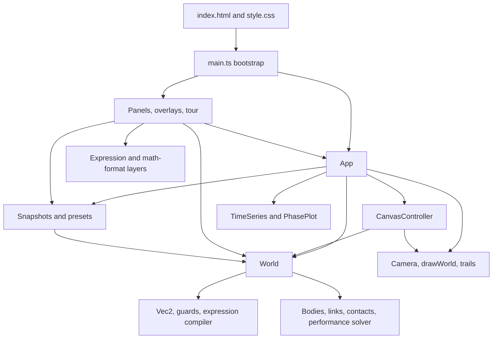
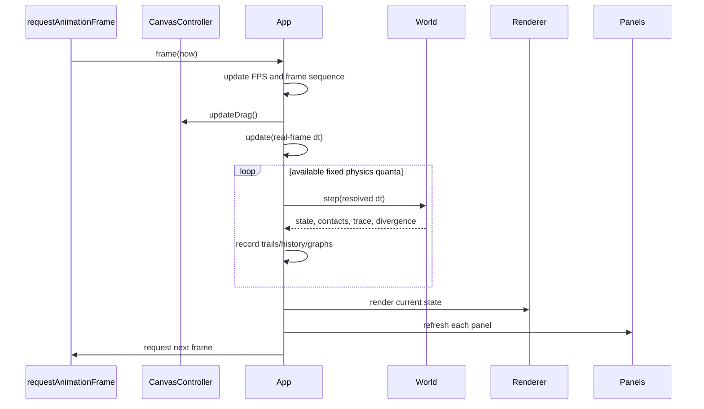

# Architecture and runtime

This page explains how the browser shell, application coordinator, headless
physics engine, interaction controller, renderer, persistence layer, and DOM
UI cooperate. See [physics engine](physics-engine.md) for solver details and
[application and UI](application-ui.md) for individual controls and gestures.

## Architectural boundaries

The arrows show runtime dependencies, not event direction. The most important
boundary is at `World`: engine modules import only `core` and other engine
modules. Browser APIs enter through `App`, scene storage, rendering,
interaction, and UI code. Consequently, engine tests can instantiate and step
a world without creating a document or canvas.

There is one deliberate type-only cycle at the application edge:
`CanvasController` needs the shape of `App`, while `App` constructs and owns a
controller. `tools.ts` uses `import type { App }`, so this does not create a
runtime module cycle.

## Bootstrap sequence

`web/index.html` supplies a fixed shell: toolbar, palette, canvas wrapper,
canvas, toast/status regions, graph dock, inspector, hint bar, and four modal
overlay roots. `main.ts` assumes these IDs exist and uses non-null lookups.

Startup proceeds in this order:

1. Import `style.css` and the application/UI modules.
2. Obtain the canvas and construct `App`. Its constructor gets the 2D context,
   creates and attaches `CanvasController`, loads and sanitizes browser
   settings, and applies theme/font settings.
3. Install the toast callback. Toasts are capped to three visible messages and
   fade after a timeout; the container is an ARIA live region.
4. Construct toolbar, palette, inspector, graph dock, hint bar, library,
   settings, help, formula guide, and guided tour.
5. Register overlay toggle callbacks, then assign all per-frame `Panel`
   objects to `app.panels`.
6. Install document-level focus cleanup, keyboard shortcuts, page-zoom
   suppression, canvas resizing, and window resize handling.
7. Load the first preset without a toast, call `app.start()`, and either start
   the first-visit tour or show the returning-user welcome toast.

Development builds expose the live app and UI objects on `window` for manual
driving. Production behavior does not depend on these handles.

## State ownership

| Owner | Long-lived state | Not owned here |
| --- | --- | --- |
| `App` | Current `World`, camera, `ViewSettings`, selection, playback speed/accumulator, adaptive-resolution preference, undo and rewind objects, initial reset snapshot, trails, plots, graph mode, clipboard properties, browser settings, performance observations, panel callbacks. | Physical integration rules, pointer gesture internals, DOM control trees. |
| `World` | Bodies, walls, links, fields, drivers, physical settings, simulation clock, contact snapshot, solver caches, adaptive-slice scratch storage, diagnostics. | Camera, selected objects, playback state, browser preferences, storage, rendering. |
| `CanvasController` | Active tool, hover, pointer coordinates, pending link/wall gestures, drag/pan/box-selection state, touch pointers and pinch state. | Canonical selection and world lists; it edits those through `App`/`World`. |
| Panels and overlays | DOM nodes, local tab/filter/open state, refresh groups, focus traps, splitter state. | Canonical physical or playback state; controls read/write `App` and `World`. |
| Snapshot module | Algorithms and storage key namespaces for snapshots, history, saved scenes, metadata, import/export. | The live world; callers explicitly pass or replace it. |
| Render modules | Reusable drawing batches and scratch arrays, camera transform, trail buffers. | Simulation progression and DOM lifecycle. |

Engine objects contain some transient solver fields for speed (`acc`, `prev`,
warm-start multipliers, packing indices, contact flags). These are part of the
live world but are intentionally absent from scene JSON. A full field-by-field
split appears in [data, formulas, and scenes](data-formulas-scenes.md).

## Frame lifecycle

`App.start()` creates a self-scheduling `requestAnimationFrame` callback. Each
frame has a stable ordering:

Calling `updateDrag()` before physics keeps a held body under a stationary
pointer even when no pointer-move event fires. Rendering precedes panel refresh
so both observe the same post-physics world. DOM controls do not drive their
own timers; their `refresh` functions are polled by the panel layer.

## Fixed-timestep scheduling

The base physics quantum is `PHYSICS_DT = 1/120 s`. The frame scheduler
separates simulated time from display timing:

- Real frame duration is capped at 0.25 s so returning from a suspended tab
  does not request an enormous catch-up.
- At speeds of 1x and above, each quantum uses the base `PHYSICS_DT` and more
  quanta are requested. Below 1x, quanta are still produced smoothly but each
  has a proportionally smaller simulated duration.
- The accumulator receives real elapsed time multiplied by playback speed.
  Its catch-up demand is capped to three nominal frames, breaking the feedback
  loop where one slow frame requests still more work from the next.
- A displayed frame runs at most 64 base quanta and spends at most 45 ms in
  physics. If the budget is exhausted, simulated time dilates instead of
  changing the numerical method.
- `overloaded` means the accumulator could not be drained. Sustained overload
  resets a fast-forward multiplier to 1x or explains how to reduce solver
  cost.

This budget policy keeps the UI responsive while preserving deterministic
physics: measured wall-clock cost decides how much simulated time a frame
advances, not the answer produced for any step that does run.

### Two adaptive levels

There are two distinct refinement systems:

1. Before each base quantum, `App.pickResolution()` asks
   `World.subdivisionNeed()` how many equal extra `World.step` calls are
   required. The estimate uses current acceleration and body-size deviation,
   is capped at 16, and excludes contact-supported and spring-supported bodies.
2. Inside a `World.step`, mutual-gravity scenes may split each configured
   substep into encounter slices. Slice size follows the rate of acceleration
   change, is bounded by a scene-derived work budget, and can refine up to the
   engine ceiling.

Both decisions depend on simulation state, never measured frame time.
Performance mode disables both refinements because they are the largest work
multipliers.

## One world step

`World.step(dt)` divides `dt` by `effectiveSubsteps`, prepares immutable
per-step caches, and repeats this pipeline for every substep:

1. Accumulate smooth accelerations and solve rod/rope constraint forces.
2. Integrate translation and spin with the effective integrator. Mutual
   gravity may use encounter slices inside this phase.
3. In performance mode, project springs using `PerfSolver`.
4. Project rigid rod/rope position error with XPBD and feed the correction
   back into velocity.
5. Rebuild contacts for the current positions, warm start them, resolve
   impacts and resting velocity constraints, project penetration, and apply
   static-friction anchoring.
6. Apply global velocity damping, interaction speed caps, and the performance
   mode speed ceiling.
7. Advance the world clock.

After all substeps, non-finite or extreme bodies are restored to their prior
position and frozen, and `stepCount` advances. Contacts stored on `World` are
only the latest substep's contacts, which is what the renderer and status bar
display.

## Rendering lifecycle

`App.render()` measures rendering cost independently from physics cost. It:

1. Applies the device-pixel-ratio transform and clears with the current theme
   background.
2. Draws the optional world grid.
3. Calls `drawWorld()` with world, camera, view settings, selection, hover,
   trails, viewport dimensions, adaptive trail quality, and performance mode.
4. Draws interaction previews and the scale bar.
5. Updates an exponential moving average of draw cost and tunes only the trail
   vertex budget.

Changing trail detail based on measured render time is safe because it changes
only how an already-computed path is displayed. No simulation state reads the
quality factor.

The overload warning distinguishes a render-bound frame from a physics-bound
one. A slow display where drawing owns most of the frame suggests reducing
trail/display work; an undrained accumulator suggests reducing physical work.

## UI refresh architecture

Controls use a getter/setter design. Construction captures how to read and
write state, and a `RefreshGroup` calls their refresh functions after every
frame. Controls suppress external refresh while the user is actively editing
so their text or caret is not overwritten.

Long inspector panels can attach an `IntersectionObserver` to skip controls
that are scrolled outside the panel. Elements with a zero-size rectangle are
treated as hidden rather than scrolled away, because some controls must refresh
themselves to become visible again.

The inspector separately tracks a structure key. It rebuilds its DOM only when
the active tab, selection types/IDs, world structure, field/driver structure,
or responsive layout requires it. Ordinary changing values are handled by
control refreshes. `App.onSelectionChange` and `App.onWorldReplaced` notify it
when a structural check is needed.

## World replacement protocol

Loading, resetting, undoing, redoing, rewinding, clearing, and importing can
replace the entire object graph. `App.replaceWorld()` is the common cleanup
path:

- install the new `World`;
- clear selection and hover;
- reset every pointer and pending construction gesture, including half-made
  links that hold direct body references;
- clear trails, graph series, phase data, and rewind history;
- invalidate the energy cache;
- reset or preserve the initial snapshot according to the caller;
- seed an open graph with the new state; and
- notify registered UI components.

`loadPreset()` adds preset-specific work after replacement: reset undo history,
apply view hints, frame the scene, capture the reset baseline, arm the soft-body
drag hint when applicable, and notify the UI after those hints are in place.

Undo/redo uses serialized snapshots and therefore also creates a fresh object
graph. Selection is normally cleared. Frame rewind preserves selected body IDs
where possible and reselects matching bodies in the reconstructed world.

## End-to-end state flows

### Editing and undo

1. A canvas gesture or inspector control mutates live objects.
2. A committed edit calls `App.pushUndo()`.
3. `UndoStack` serializes the whole world unless the snapshot is identical to
   the current history entry.
4. If the edit is at simulation time zero, the reset snapshot and baseline
   energy are updated to make the edited setup the new start state.
5. Undo or redo restores a serialized world and routes through the replacement
   protocol.

Continuous control motion may update values many times, but reusable controls
receive an `onCommit` callback so one completed interaction creates the history
entry.

### Playing, rewind, and reset

- The first play/step captures an initial full snapshot and baseline energy.
- After a displayed physics update, `RewindBuffer` records a keyframe or compact
  dynamic delta and graph series receive a throttled sample.
- Frame rewind pops the current recorded frame, reconstructs the previous one,
  truncates graph data to its clock, and pauses playback.
- Reset reconstructs the original snapshot but preserves that snapshot so
  repeated reset remains meaningful.

### Formula editing and evaluation

1. Inspector formula controls edit the stored `fxSrc`/`fySrc` strings.
2. On commit, `ForceField.compile()` invokes the restricted expression parser
   and compiler. Parse failure leaves the source visible, stores an error, and
   disables evaluation for that field.
3. During `World` force accumulation, enabled compiled fields receive a reused
   environment record for each movable body.
4. Non-finite or throwing samples are skipped for that body without aborting
   the whole step.

The typeset editor is only a view over the same source string; details are in
[data, formulas, and scenes](data-formulas-scenes.md#force-field-expression-language).

### Save, load, import, and export

- `World.toDict()` defines the portable scene model; `JSON.stringify` produces
  a snapshot.
- Browser scene saves use the `mechanica.scene.` local-storage namespace.
  Descriptions use a separate metadata namespace so the portable scene payload
  remains compatible.
- Loading parses JSON and passes every supported collection through
  `World.fromDict`, which applies defaults/ranges and reconstructs link object
  references from body IDs.
- Export creates a formatted JSON blob and clicks a temporary download anchor.
- Import reads one selected JSON file, restores a world, then routes through
  the application replacement and framing paths.

## Deterministic and adaptive boundaries

The project intentionally separates choices that may affect the physical
answer from choices that affect only responsiveness or presentation:

| State-derived and deterministic | Machine/display-derived and presentational |
| --- | --- |
| Integrator, authored substeps/iterations, App subdivision need, encounter slicing, solver work ceilings derived from scene structure, fixed-step sequence. | Number of quanta completed before a frame-time budget, trail drawing quality, DOM culling, canvas device-pixel ratio, camera easing, graph redraw skipping. |

Performance mode is user-selected and intentionally changes accuracy. It is a
browser preference rather than scene data, so sharing a scene does not impose
that tradeoff on another user.

## Failure containment and feedback

- Scene/settings inputs are parsed behind guards and defaults.
- A step-level exception is caught by `App.safeStep`; body-level numerical
  divergence is normally handled by `World.sanitize`.
- Divergence notifications are throttled, and only a few names are included.
- Runaway culling is optional, uses a scene-fixed reference rather than camera
  position, and removes only far, outward-moving bodies.
- Storage failures on the primary save paths become user-facing toasts.
- MathLive failure leaves the plain text formula editor and source rendering
  usable.
- Resize observers keep canvas backing dimensions aligned with CSS size and
  device pixel ratio.
- Focus traps and escape precedence ensure modal overlays do not leak keyboard
  commands to the simulation underneath.

These mechanisms keep the page interactive and preserve recoverable state;
they do not promise that arbitrary physical parameters produce an accurate
model. The solver-specific accuracy boundaries are documented in [physics
engine](physics-engine.md#numerical-tradeoffs).
