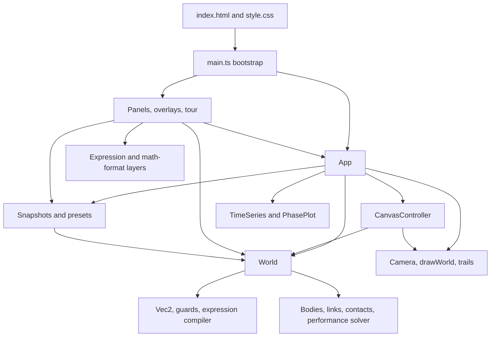

# Architecture and runtime

This page explains how the browser shell, application coordinator, headless
physics engine, interaction controller, renderer, persistence layer, and DOM
UI cooperate. See [physics engine](physics-engine.md) for solver details and
[application and UI](application-ui.md) for individual controls and gestures.

## Architectural boundaries



The arrows show runtime dependencies, not event direction. The most important
boundary is at `World`: engine modules import only `core` and other engine
modules. Browser APIs enter through `App`, scene storage, rendering,
interaction, and UI code. Consequently, engine tests can instantiate and step
a world without creating a document or canvas.

There is one deliberate type-only cycle at the application edge:
`CanvasController` needs the shape of `App`, while `App` constructs and owns a
controller. `tools.ts` uses `import type { App }`, so this does not create a
runtime module cycle.

## Bootstrap sequence

`web/index.html` supplies a fixed shell: toolbar, palette, canvas wrapper,
canvas, toast/status regions, graph dock, inspector, hint bar, and four modal
overlay roots. `main.ts` assumes these IDs exist and uses non-null lookups.

Startup proceeds in this order:

1. Import `style.css` and the application/UI modules.
2. Obtain the canvas and construct `App`. Its constructor gets the 2D context,
   creates and attaches `CanvasController`, loads and sanitizes browser
   settings, and applies theme/font settings.
3. Install the toast callback. Toasts are capped to three visible messages and
   fade after a timeout; the container is an ARIA live region.
4. Construct toolbar, palette, inspector, graph dock, hint bar, library,
   settings, help, formula guide, and guided tour.
5. Register overlay toggle callbacks, then assign all per-frame `Panel`
   objects to `app.panels`.
6. Install document-level focus cleanup, keyboard shortcuts, page-zoom input
   suppression, canvas resizing, and window resize handling. Unmodified wheel
   and touch zoom remain scoped to the simulation and graph surfaces.
7. Install the first preset through `initializePreset()` without a toast, call
   `app.start()`, and either start the first-visit tour or show the
   returning-user welcome toast. This startup call is the only scene load that
   intentionally resets edit history.

Development builds expose the live app and UI objects on `window` for manual
driving. Production behavior does not depend on these handles.

## State ownership

| Owner | Long-lived state | Not owned here |
| --- | --- | --- |
| `App` | Current `World`, camera, `ViewSettings`, selection, playback speed/accumulator, adaptive-resolution preference, active edit transaction, undo and rewind objects, initial reset snapshot, trails, plots, graph mode, clipboard properties, browser settings, canvas invalidation generation, performance observations, panel callbacks. | Physical integration rules, pointer gesture internals, DOM control trees. |
| `World` | Bodies, walls, links, fields, drivers, physical settings, simulation clock, contact snapshot, solver caches, adaptive-slice scratch storage, diagnostics. | Camera, selected objects, playback state, browser preferences, storage, rendering. |
| `CanvasController` | Active tool, hover, pointer coordinates, pending link/wall gestures, drag/pan/box-selection state, touch pointers and pinch state. | Canonical selection and world lists; it edits those through `App`/`World`. |
| Panels and overlays | DOM nodes, local tab/filter/open state, refresh groups, focus traps, splitter state. | Canonical physical or playback state; controls read/write `App` and `World`. |
| Snapshot module | Algorithms and storage key namespaces for snapshots, history, saved scenes, metadata, import/export. | The live world; callers explicitly pass or replace it. |
| Render modules | Reusable drawing batches and scratch arrays, camera transform, trail buffers. | Simulation progression and DOM lifecycle. |

Engine objects contain some transient solver fields for speed (`acc`, `prev`,
warm-start multipliers, packing indices, contact flags). These are part of the
live world but are intentionally absent from scene JSON. A full field-by-field
split appears in [data, formulas, and scenes](data-formulas-scenes.md).

## Frame lifecycle

`App.start()` creates a self-scheduling display callback. Active playback uses
`requestAnimationFrame`; paused state waits on a 50 ms idle timer and then
requests a frame. Canvas invalidation or playback wakes the loop immediately,
so pointer/camera edits retain low latency without polling an unchanged scene
at monitor rate. Each callback has a stable ordering:

```mermaid
sequenceDiagram
    participant RAF as requestAnimationFrame
    participant C as CanvasController
    participant A as App
    participant W as World
    participant R as Renderer
    participant P as Panels

    RAF->>A: frame(now)
    A->>A: update playback FPS
    A->>C: updateDrag()
    A->>A: update(real-frame dt)
    loop available fixed physics quanta
        A->>W: step(resolved dt) through shared batch runner
        W-->>A: state, contacts, trace, divergence
        A->>A: record trail samples
    end
    A->>A: stop on first failure; record rewind and graphs
    A->>R: render current state when visually dirty
    A->>A: update paused paint FPS or return to Idle
    A->>P: refresh panels when their cadence is due
    A->>RAF: request active frame or schedule paused wake
```

Calling `updateDrag()` before physics keeps a held body under a stationary
pointer even when no pointer-move event fires. A retained canvas image is
redrawn only after visual invalidation. Panels are polled at 30 Hz while
playing and 20 Hz while paused; their readouts still observe post-physics
state. The energy readout is revision-cached against physical state rather
than display frames, so an unchanged paused mutual-gravity scene does not
repeat its quadratic pair-energy pass.

Playback FPS is sampled only while the simulation is running. Paused camera
and editing gestures separately time frames that actually repaint the retained
canvas; a first paint starts the sample, continued paints expose their measured
cadence, and the readout returns to `Idle` shortly after painting stops. Skipped
paused callbacks are excluded, so the power-saving timer is never presented as
a rendering limit.

## Fixed-timestep scheduling

The Normal-mode physics quantum is `PHYSICS_DT = 1/120 s`. Performance levels
2 and 3 use `1/60 s`; this is an explicit accuracy trade selected by the user.
The frame scheduler separates simulated time from display timing:

- Real frame duration is capped at 0.25 s so returning from a suspended tab
  does not request an enormous catch-up.
- At speeds of 1x and above, each quantum uses the base `PHYSICS_DT` and more
  quanta are requested. Below 1x, quanta are still produced smoothly but each
  has a proportionally smaller simulated duration.
- The accumulator receives real elapsed time multiplied by playback speed.
  Its catch-up demand is capped to three nominal frames, breaking the feedback
  loop where one slow frame requests still more work from the next.
- A displayed frame runs at most 64 base quanta and spends at most 45 ms in
  physics. If the budget is exhausted, simulated time dilates instead of
  changing the numerical method.
- `overloaded` means the accumulator could not be drained. Sustained overload
  resets a fast-forward multiplier to 1x or explains how to reduce solver
  cost.

While playback is active, Performance mode separately samples frame, physics,
and render moving averages every 250 ms. Sustained pressure raises its
transient approximation level after 250-750 ms; five seconds of comfortable
headroom relaxes one level. The chosen
level is then passed explicitly to `World`, so every completed step at that
level has a defined algorithm even though the browser's level selection is
machine-load-dependent. Adaptation runs before drawing, so a DPR-changing level
transition clears and repaints the backing store in the same callback rather
than exposing a blank intermediate frame. Paused idle and interaction frames
do not change the approximation level because no real-time simulation is being
kept up.

This budget policy keeps the UI responsive while preserving deterministic
physics: measured wall-clock cost decides how much simulated time a frame
advances, not the answer produced for any step that does run.

Play, single-step, and time-jump all use the same physics batch primitive. A
batch stops at the first solver exception or reported divergence; no later
step can overwrite the first diagnostic. The application aggregates affected
body names, pauses playback, clears pending accumulated time, and emits one
throttled actionable message.

### Two adaptive levels

There are two distinct refinement systems:

1. Before each base quantum, `App.pickResolution()` asks
   `World.subdivisionNeed()` how many equal extra `World.step` calls are
   required. The estimate uses current acceleration and body-size deviation,
   is capped at 16, and excludes contact-supported and spring-supported bodies.
2. Inside a `World.step`, mutual-gravity scenes may split each configured
   substep into encounter slices. Slice size follows the rate of acceleration
   change, is bounded by a scene-derived work budget, and can refine up to the
   engine ceiling.

Both Normal-mode refinement decisions depend on simulation state, never
measured frame time. Performance mode disables both because they are the
largest work multipliers, then uses its explicitly approximate load-selected
profile instead.

## One world step

`World.step(dt)` divides `dt` by `effectiveSubsteps`, prepares immutable
per-step caches, and repeats this pipeline for every substep:

1. Synchronize wall-mounted pulley geometry, normalize live pulley-particle
   sizes, accumulate smooth accelerations, and solve rod/rope plus equal-tension
   pulley-string constraint forces. A wrong-side pulley trial suppresses its
   force row until the topology guard restores it.
2. Integrate translation and spin with the effective integrator. Mutual
   gravity may use encounter slices inside this phase.
3. In performance mode, project springs using `PerfSolver`.
4. Project taut pulley-string and rigid rod/rope position error with XPBD,
   enforce swept terminal wheel and routing-half-plane stops for each pulley
   particle, and feed only feasible corrections back into velocity.
5. Rebuild contacts for the current positions, warm start them, resolve
   impacts and resting velocity constraints, project penetration, and apply
   static-friction anchoring. Maximum approximation retains only normal
   bounce/separation and penetration work.
6. Apply global velocity damping, interaction speed caps, and the performance
   mode speed ceiling.
7. Advance the world clock.

After all substeps, eligible settled bodies may enter Performance-mode sleep,
non-finite or extreme bodies are restored to their prior position and frozen,
and each movable body publishes the realised step-average resultant
`mass * (finalVelocity - initialVelocity) / dt`. This diagnostic therefore
includes contacts, links, damping, and safety stops that the integrator's last
smooth `acc` sample cannot represent. `stepCount` then advances. Contacts
stored on `World` are only the latest substep's contacts, which is what the
renderer and status bar display.

## Rendering lifecycle

`App` keeps a coalescing canvas generation. Resize, appearance/view changes,
scene edits or replacement, selection, pointer previews, and camera changes
invalidate it. A displayed physics batch compares a reusable snapshot of only
the body values used by the active renderer; advancing an empty or settled
world's clock does not invalidate unchanged pixels. Trail insertion/expiry and
enabled contact diagnostics invalidate independently.

`App.render()` first compares direct camera/view inputs with their last drawn
values. If the generation is unchanged it retains the existing pixels, decays
the measured render-cost average toward zero, and skips all Canvas calls. A
dirty render measures cost independently from physics cost and:

1. Applies the effective device-pixel-ratio transform and paints the current
   theme background. Normal mode uses native DPR; Performance levels 0-3 cap
   it at `1.5`, `1.25`, `1`, and `1` without changing CSS/input geometry.
2. Draws the optional world grid; maximum level omits minor lines.
3. Calls `drawWorld()` with world, camera, view settings, selection, hover,
   Normal-mode trails, viewport dimensions, adaptive trail quality,
   performance mode, and the in-canvas pointer used by optional force-arrow
   readouts. Performance mode omits trail drawing entirely. Link-force geometry
   receives a second pass only when at least one link enables its transient
   overlay.
4. Draws interaction previews and the scale bar.
5. Updates an exponential moving average of draw cost and tunes only the trail
   vertex budget.

Maximum level shows labels/vectors only for the hovered or selected body,
suppresses contact and spatial-grid diagnostics, and—only after at least 750 ms
of continuing maximum-
level overload or excess render cost—presents alternate simulation frames.
Physics and input continue each display tick; the visual fallback is
approximately 30 Hz rather than allowing raster work to make simulated time
fall indefinitely behind.

Changing trail detail based on measured render time is safe because it changes
only how an already-computed path is displayed. No simulation state reads the
quality factor.

The 2D context requests an opaque backing store because every dirty frame
paints the entire background. Resize handling writes canvas backing dimensions
only when their device-pixel dimensions change, while CSS-size changes still
update the camera and invalidate drawing.

Sparse Normal-mode trail stroke batches are cached by colour. Dense Normal-mode
scenes instead draw each trail as one bounded current path, avoiding viewport-
sized disjoint `Path2D` raster bounds. Performance mode clears existing trail
buffers and skips sampling, maintenance, and drawing. Every Normal-mode draw
removes colour groups absent from the current world and ignores stale body IDs;
world and history replacement also clear per-body trail buffers.

The overload warning distinguishes a render-bound frame from a physics-bound
one. Lower Performance profiles suppress it while the adaptive controller can
still respond; it appears in Performance mode only after maximum approximation
remains slow for at least 750 ms. A slow display where drawing owns most of the frame suggests
reducing trail/display work; an undrained accumulator suggests reducing
physical work.

## UI refresh architecture

Controls use a getter/setter design. Construction captures how to read and
write state, and a `RefreshGroup` calls their refresh functions after every
frame. Controls suppress external refresh while the user is actively editing
so their text or caret is not overwritten.

Long inspector panels can attach an `IntersectionObserver` to skip controls
that are scrolled outside the panel. Elements with a zero-size rectangle are
treated as hidden rather than scrolled away, because some controls must refresh
themselves to become visible again.

The inspector separately tracks a structure key. It rebuilds its DOM only when
the active tab, selection types/IDs, world structure, field/driver structure,
or responsive layout requires it. Ordinary changing values are handled by
control refreshes. `App.onSelectionChange` and `App.onWorldReplaced` notify it
when a structural check is needed.

## World replacement protocol

Loading, resetting, undoing, redoing, rewinding, clearing, and importing can
replace the entire object graph. `App.replaceWorld()` is the common cleanup
path:

- install the new `World`;
- clear selection and hover;
- reset every pointer and pending construction gesture, including half-made
  links that hold direct body references;
- clear trails, graph series, timestamped phase data, and rewind history;
- invalidate the energy cache;
- reset rewind-unavailable and divergence-notification state;
- reset or preserve the initial snapshot according to the caller;
- seed an open graph with the new state; and
- notify registered UI components.

`loadPreset()` adds preset-specific work after replacement: apply view hints,
frame the scene, capture the reset baseline, arm the soft-body drag hint when
applicable, and notify the UI after those hints are in place. Presets, saved
scenes, uploaded worlds, and scene clearing are ordinary before/after edit
transactions, so one undo restores the replaced live scene. Only
`initializePreset()` discards history during startup. A failed or cancelled
load never reaches `replaceWorld()` and leaves both the live scene and history
unchanged.

Undo/redo uses serialized snapshots and therefore also creates a fresh object
graph. Selection is normally cleared. Frame rewind preserves selected body IDs
where possible and reselects matching bodies in the reconstructed world.

## End-to-end state flows

### Editing and undo

1. Before an immediate mutation or the first update of a continuous gesture,
   the caller invokes `App.beginEdit()`. It captures the exact live world,
   including any simulation evolution since the preceding edit.
2. The canvas gesture, inspector control, action, formula recipe, paste, or
   scene replacement mutates the live state. Continuous motion reuses the same
   captured boundary.
3. `App.commitEdit()` captures the post-edit state and calls
   `UndoStack.pushTransition(before, after)`. Invalid, cancelled, or unchanged
   controls call `cancelEdit()` or produce the `unchanged` result.
4. If the edit is at simulation time zero, the reset snapshot and baseline
   energy are updated to make the edited setup the new start state.
5. Undo or redo reconstructs a fresh world and routes through the replacement
   protocol.

`UndoStack` retains at most 120 full snapshots and an estimated 48,000,000
bytes. Removing a redo tail and evicting old entries updates the same byte
accounting. Store operations return `unchanged`, `stored`, or `too-large`. A
snapshot or exact before/after boundary that cannot fit resets history to the
current post-edit state, reports `too-large`, and leaves undo unavailable
instead of retaining a partial transaction.

### Playing, rewind, and reset

- The first play/step captures an initial full snapshot and baseline energy.
- After a displayed physics update, `RewindBuffer` records a keyframe or compact
  dynamic delta under its 48,000,000-byte and 3,000-frame ceilings, and graph
  series receive a throttled sample. An individual frame that cannot fit
  clears rewind state and returns `too-large`. Normal mode records each
  displayed update; Performance levels 0-3 cap rewind capture at 60, 30, 15,
  and 8 samples per simulated second.
- Frame rewind pops the current recorded frame, reconstructs the previous one,
  truncates energy, momentum, and timestamped phase data to its clock, and
  pauses playback.
- Reset reconstructs the original snapshot but preserves that snapshot so
  repeated reset remains meaningful.

Internal history reconstruction uses `restoreSnapshot()`, which preserves
finite accumulated body and driver angles exactly. Saved and uploaded data use
the untrusted `restore()` path, which applies import normalization and resource
limits before the world becomes live.

### Time jumps

Time-jump input must be a complete finite non-negative decimal literal; signs
other than an optional leading `+`, hexadecimal/binary/octal syntax, units,
and trailing text are rejected. A scene loaded with a nonzero clock uses that
clock as its baseline, and targets before it are rejected.

A target ahead of the current clock continues from an exact internal copy of
the current world. A target behind it reconstructs the stored baseline and
simulates forward. The target is rounded to the nearest fixed
`PHYSICS_DT` quantum, so the installed clock is at most half a quantum from
the requested value. Even a backward target requiring zero steps installs the
baseline copy. Work is bounded by both 20,000 steps and a 3,000 ms wall-clock
budget; an incomplete jump reports the reached time and can be continued, and
the shared batch runner stops immediately on numerical failure.

### Formula editing and evaluation

1. Inspector formula controls edit the stored `fxSrc`/`fySrc` strings.
2. On commit, `ForceField.compile()` compiles both axes into local functions
   before installing either. Any parse, complexity, stack, compile, or probe
   failure becomes `ExprError`, leaves both source strings visible, stores an
   actionable error, and clears both compiled axes so no stale closure remains
   active.
3. During `World` force accumulation, enabled compiled fields receive a reused
   environment record for each movable body.
4. Non-finite or throwing samples are skipped for that body without aborting
   the whole step.

The typeset editor is only a view over the same source string; details are in
[data, formulas, and scenes](data-formulas-scenes.md#force-field-expression-language).

### Save, load, import, and export

- `World.toDict()` defines the portable scene model; `JSON.stringify` produces
  a snapshot.
- Browser scene saves use the `mechanica.scene.` local-storage namespace.
  Descriptions use a separate metadata namespace so the portable scene payload
  remains compatible.
- Loading parses JSON and passes every supported collection through the
  untrusted `World.fromDict` path, which applies type/default/range guards,
  resource caps, angle normalization, duplicate-ID remapping, and link
  reference reconstruction. A collection above its cap throws
  `SceneLimitError` before any objects are constructed.
- Export creates a formatted JSON blob and clicks a temporary download anchor.
- Import rejects files larger than 10 MiB before reading, then restores one
  selected JSON file and routes only a successful result through the undoable
  replacement and framing paths. Saved-scene and file reads use discriminated
  `loaded`, `cancelled`, `missing`, `invalid`, `too-large`, and
  `storage-error` results so cancellation stays silent and each failure gets
  specific feedback.

## Deterministic and adaptive boundaries

The project intentionally separates choices that may affect the physical
answer from choices that affect only responsiveness or presentation:

| State-derived and deterministic | Machine/display-derived and presentational |
| --- | --- |
| Normal-mode integrator, authored substeps/iterations, App subdivision need, encounter slicing, solver work ceilings derived from scene structure, fixed-step sequence. A selected Performance level also has a deterministic engine algorithm. | Number of quanta completed before a frame-time budget, Performance-level selection, Performance-mode quantum/DPR/render cadence, trail drawing quality, DOM culling, camera easing, graph redraw skipping. |

Performance mode is user-selected and intentionally changes accuracy. It is a
browser preference rather than scene data, so sharing a scene does not impose
that tradeoff on another user.

## Failure containment and feedback

- Scene/settings inputs are parsed behind guards and defaults.
- A step-level exception is caught by the shared batch runner; body-level
  numerical divergence is normally contained by `World.sanitize`. Play,
  single-step, and time-jump stop on the first failure.
- Divergence notifications aggregate affected bodies, include only a few names
  in the message, and are throttled.
- Runaway culling is optional, uses a scene-fixed reference rather than camera
  position, and removes only far, outward-moving bodies.
- Saved-scene mutation failures become typed errors and user-facing toasts;
  multi-key rename/delete operations attempt to restore their prior keys.
- MathLive failure leaves the plain text formula editor and source rendering
  usable.
- Resize observers keep canvas backing dimensions aligned with CSS size and
  device pixel ratio.
- Focus traps and escape precedence ensure modal overlays do not leak keyboard
  commands to the simulation underneath.

These mechanisms keep the page interactive and preserve recoverable state;
they do not promise that arbitrary physical parameters produce an accurate
model. The solver-specific accuracy boundaries are documented in [physics
engine](physics-engine.md#numerical-tradeoffs).
